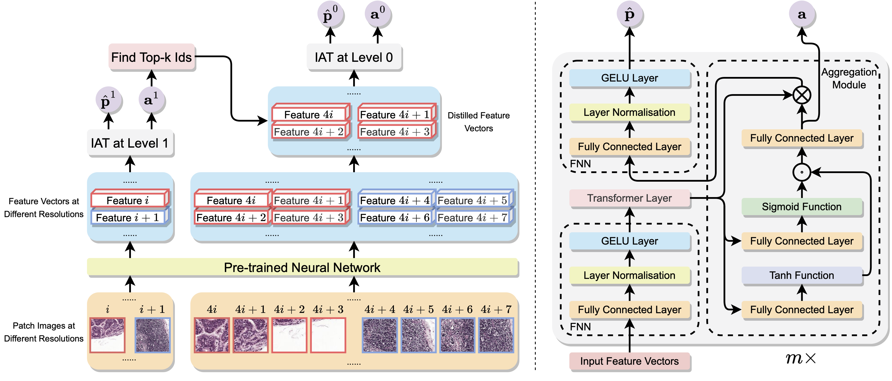

Diagnose Like a Pathologist: Transformer-Enabled Hierarchical Attention-Guided Multiple Instance Learning for Whole Slide Image Classification (IJCAI-2023)
===========
[Conghao Xiong](https://bearcleverproud.github.io/), [Hao Chen](https://cse.hkust.edu.hk/~jhc/), [Joseph J.Y. Sung](https://www.ntu.edu.sg/about-us/leadership-organisation/profiles/professor-joseph-sung) and [Irwin King](https://www.cse.cuhk.edu.hk/irwin.king/home)

[ArXiv](https://arxiv.org/abs/2301.08125) | [IJCAI Link](https://www.ijcai.org/proceedings/2023/176)



**Abstract:** Multiple Instance Learning (MIL) and transformers are increasingly popular in histopathology Whole Slide Image (WSI) classification. However, unlike human pathologists who selectively observe specific regions of histopathology tissues under different magnifications, most methods do not incorporate multiple resolutions of the WSIs, hierarchically and attentively, thereby leading to a loss of focus on the WSIs and information from other resolutions. To resolve this issue, we propose a Hierarchical Attention-Guided Multiple Instance Learning framework to fully exploit the WSIs. This framework can dynamically and attentively discover the discriminative regions across multiple resolutions of the WSIs. Within this framework, an Integrated Attention Transformer is proposed to further enhance the performance of the transformer and obtain a more holistic WSI (bag) representation. This transformer consists of multiple Integrated Attention Modules, which is the combination of a transformer layer and an aggregation module that produces a bag representation based on every instance representation in that bag. The experimental results show that our method achieved state-of-the-art performances on multiple datasets, including Camelyon16, TCGA-RCC, TCGA-NSCLC, and an in-house IMGC dataset.

## Updates:
* 2023 Oct 11th: Created this repository and first push

## Pre-requisites:
* Linux (Tested on Ubuntu 18.04)
* NVIDIA GPU (Tested on NVIDIA GeForce RTX 3090)

## Installation
* Obtain [Miniconda](https://docs.conda.io/projects/miniconda/en/latest/) on the machine.
* (Optional: you may skip this step if you have already obtained the feature vectors) After setting up miniconda, install [openslide](https://openslide.org/) on the machine using the following command:
  ``` shell
  sudo apt-get install openslide-tools
  ```
* Create a new environment in Anaconda using the provided yml file `environment.yml` and the following command:
  ```
  conda env create -f environment.yml
  ```
* Install [smooth-topk](https://github.com/oval-group/smooth-topk). We recommend to switch to a folder that is suitable for git clone instead of in the project folder using commands below:
  ```
  git clone https://github.com/oval-group/smooth-topk.git
  cd smooth-topk
  python setup.py install
  ```
  
## WSI Segmentation and Patching 

Thanks to the great work of [CLAM](https://github.com/mahmoodlab/CLAM/tree/master). In this step, we used codes of [CLAM](https://github.com/mahmoodlab/CLAM/tree/master), and we copy the instructions here from their repository.

The first step focuses on segmenting the tissue and excluding any holes. The segmentation of specific slides can be adjusted by tuning the individual parameters (e.g. dilated vessels appearing as holes may be important for certain sarcomas.) 
The following example assumes that digitized whole slide image data in well known standard formats (.svs, .ndpi, .tiff etc.) are stored under a folder named DATA_DIRECTORY:

```bash
DATA_DIRECTORY/
	├── slide_1.svs
	├── slide_2.svs
	└── ...
```

### Fully Automated Run
First, pull the codes from [CLAM](https://github.com/mahmoodlab/CLAM/tree/master) using the following commands. We recommend not to clone the codes to the project folder.
```
git clone https://github.com/mahmoodlab/CLAM.git
cd CLAM
```

Then run the patch creation scripts from [CLAM](https://github.com/mahmoodlab/CLAM/tree/master) as follows:

``` shell
python create_patches_fp.py --source DATA_DIRECTORY --save_dir RESULTS_DIRECTORY --patch_size 256 --seg --patch --stitch --patch_level 2
```

The above command will segment every slide in DATA_DIRECTORY using default parameters, extract all patches within the segmented tissue regions, create a stitched reconstruction for each slide using its extracted patches (optional) and generate the following folder structure at the specified RESULTS_DIRECTORY:

```bash
RESULTS_DIRECTORY/
	├── masks
    		├── slide_1.png
    		├── slide_2.png
    		└── ...
	├── patches
    		├── slide_1.h5
    		├── slide_2.h5
    		└── ...
	├── stitches
    		├── slide_1.png
    		├── slide_2.png
    		└── ...
	└── process_list_autogen.csv
```

Then given the level 2 coordinations, we generate the patches that contain exactly the same content at higher resolutions (level 1 and level 0) using the provided file in this repo:

```
python3 create_quadtree_wsis.py
```

Note that the default setting is for Camelyon16 dataset, which starts at level 2 with patch size 256 x 256. If you need other patch sizes or starting at different levels, you may need to revise the `create_quadtree_wsis.py`.

## Feature Extraction from the Cropped Patches
This part is also based on the codes from [CLAM](https://github.com/mahmoodlab/CLAM/tree/master). The content of this section is copied here.

### Feature Extraction (GPU Example)
```bash
CUDA_VISIBLE_DEVICES=0,1 python extract_features_fp.py --data_h5_dir DIR_TO_COORDS --data_slide_dir DATA_DIRECTORY --csv_path CSV_FILE_NAME --feat_dir FEATURES_DIRECTORY --batch_size 512 --slide_ext .svs
```

The above command expects the coordinates .h5 files to be stored under DIR_TO_COORDS and will use 2 GPUs (0 and 1) and a batch size of 512 to extract 1024-dim features from each tissue patch for each slide in the given csv list and produce the following folder structure:
```bash
FEATURES_DIRECTORY/
    └── pt_files
            ├── slide_1.pt
            ├── slide_2.pt
            └── ...
```
where each .h5 file contains an array of extracted features along with their patch coordinates (note for faster training, a .pt file for each slide is also created for each slide, containing just the patch features). The csv file is expected to contain a list of slide filenames (without the filename extensions) to process (the easiest option is to take the csv file auto generated by the previous segmentation/patching step, and delete the filename extensions)

Note that in our work, we use multiple resolutions of the WSIs (the default is 2 for Camelyon16). The naming rule is that the feature folders should end with "_level_2", "_level_1_corresponding" and "_level_0_corresponding".

### Datasets
The data used for training, validation and testing are expected to be organized as follows:
```bash
DATA_ROOT_DIR/
    ├──DATASET_1_DATA_DIR/
        └── pt_files
                ├── slide_1.pt
                ├── slide_2.pt
                └── ...
    ├──DATASET_2_DATA_DIR/
        └── pt_files
                ├── slide_a.pt
                ├── slide_b.pt
                └── ...
    └──DATASET_3_DATA_DIR/
        └── pt_files
                ├── slide_i.pt
                ├── slide_ii.pt
                └── ...
    └── ...
```
Namely, each dataset is expected to be a subfolder (e.g. DATASET_1_DATA_DIR) under DATA_ROOT_DIR, and the features extracted for each slide in the dataset is stored as a .pt file sitting under the **pt_files** folder of this subfolder.
Datasets are also expected to be prepared in a csv format containing at least 3 columns: **case_id**, **slide_id**, and 1 or more labels columns for the slide-level labels. Each **case_id** is a unique identifier for a patient, while the **slide_id** is a unique identifier for a slide that correspond to the name of an extracted feature .pt file. This is necessary because often one patient has multiple slides, which might also have different labels. When train/val/test splits are created, we also make sure that slides from the same patient do not go to different splits. The slide ids should be consistent with what was used during the feature extraction step.

Dataset objects used for actual training/validation/testing can be constructed using the **Generic_MIL_Dataset** Class (defined in **datasets/dataset_generic.py**).

For training, look under `datasets/dataset_module.py`:
```python 
dataset = Generic_MIL_Dataset(csv_path = config_dict['data_arguments']['ground_truth_csv'],
                                data_dir = config_dict['data_arguments']['feature_dir'],
                                shuffle = config_dict['data_arguments']['shuffle_data'], 
                                seed = config_dict['hyperparams_arguments']['seed'], 
                                print_info = config_dict['data_arguments']['print_info'],
                                label_dict = config_dict['data_arguments']['label_dict'],
                                patient_strat = config_dict['data_arguments']['patient_strat'],
                                ignore = [])
```
The user would need to pass:
* csv_path: the path to the dataset csv file
* data_dir: the path to saved .pt features
* shuffle: whether to shuffle the dataset
* seed: the random seed used to create the dataset
* label_dict: a dictionary that maps labels in the label column to numerical values
* patient_strat: whether to ensure slides from the same patient is in the same split (train/val/test)
* label_col: name of the label column (optional, by default it's 'label')
* ignore: labels to ignore (optional, by default it's an empty list)

### Training Splits
The split of Camelyon16 dataset is already given in the `csvs/` folder. Our experiments are also based on this split. We train the model on the training dataset, validate on the validation dataset and test only once at the test dataset. For other datasets or you would like to create your own split, please follow the instructions from [CLAM](https://github.com/mahmoodlab/CLAM/tree/master). 

### GPU Training on the Camelyon16 Dataset Using Our Default Settings
Run the following script:
``` shell
python3 main.py
```

However, this training code is only runnable when GPU memory is at least larger than 24G and by default the code uses four GPUs. If you are running on a machine that has less GPU memory, you might need to change the number of patches reserved for the next resolutions (`t_patch` and `v_patch` in the config file).

During training, the user can go into the results folder for the particular experiment, run:
``` shell
tensorboard --logdir RESULT_DIR
```
This should open a browser window and show the logged training/validation statistics in real time. 

### Testing and Evaluation Script
User also has the option of using the evluation script to test the performances of trained models. A trained model for Camelyon16 can be accessed [here](https://drive.google.com/file/d/1li_G8EnRvGfacEakc2xJ86DYVie3q__X/view?usp=sharing). The model has achieved 0.9627 AUC, 0.9302 accuracy and 0.9250 F1 score on the official Camelyon16 test dataset.

Simply download it from the url and run the following command:
```
python3 test.py --ckpt-path CKPT_PATH
```

## Issues
- Please report all issues on GitHub.

## Funding
The work described here was partially supported by grants from the National Key Research and Development Program of China (No. 2018AAA0100204) and from the Research Grants Council of the Hong Kong Special Administrative Region, China (CUHK 14222922, RGC GRF, No. 2151185). The results shown in this paper are based upon data generated by the [TCGA Research Network](https://www.cancer.gov/tcga).

## Reference
If you find our work useful in your research or if you use parts of this code please consider citing our [paper](https://www.ijcai.org/proceedings/2023/176):

```
@inproceedings{ijcai2023p176,
  title     = {Diagnose Like a Pathologist: Transformer-Enabled Hierarchical Attention-Guided Multiple Instance Learning for Whole Slide Image Classification},
  author    = {Xiong, Conghao and Chen, Hao and Sung, Joseph J.Y. and King, Irwin},
  booktitle = {Proceedings of the Thirty-Second International Joint Conference on
               Artificial Intelligence, {IJCAI-23}},
  publisher = {International Joint Conferences on Artificial Intelligence Organization},
  editor    = {Edith Elkind},
  pages     = {1587--1595},
  year      = {2023},
  month     = {8},
  note      = {Main Track},
  doi       = {10.24963/ijcai.2023/176},
  url       = {https://doi.org/10.24963/ijcai.2023/176},
}

```
